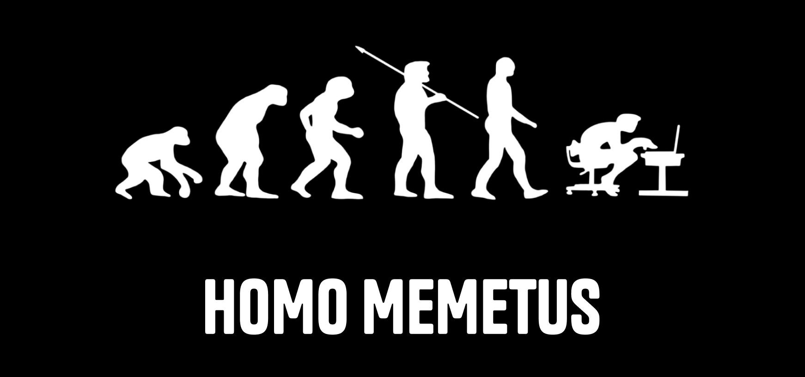

# 🚀 Memetus-Pumpfun-SDK



**Memetus-Pumpfun-SDK** provides a feature that allows user to query tokens created within the last 24 hours on Pumpfun using various parameters.


---

## ✨ Features

- ✅ Fast and lightweight
- 💡 Simple, intuitive API
- ⚙️ Fully TypeScript supported
- 🔒 Does not require an API key
- 📦 Various query parameter

---

## 📦 Installation

```bash
npm install @0xobedient/memetus-pumpfun-sdk
# or
yarn add @0xobedient/memetus-pumpfun-sdk
# or
pnpm install @0xobedient/memetus-pumpfun-sdk
```
